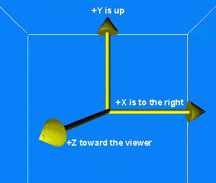

# 坐标系

## 空间直角坐标系

强调一下，这里所有提到的空间直角坐标系都是右手坐标系，什么是右手坐标系呢？

X轴朝右，Y轴朝上，Z轴垂直于X-Y轴构成的平面，方向朝外，可以伸出自己的右手：

大拇指朝外，食指朝右，中指朝上就构成了一个直角坐标系，大拇指、食指和中指分别代表Z轴、X轴和Y轴。其实这个记忆方法并不好，以前就跟很多人讨论坐标系的时候发生误解（就是两个人的理解都是正确的，但表达出来却是完全不一样的）。很多情况下，并不总是Y轴朝上，Z轴朝外的，可是我们只需要记住，”伸出右手，大拇指指向z轴，手掌合拢的方向就是X轴--->Y轴的方向“！我是这样记忆的，不知道对于其他人是否别扭。

 此外，我们明确一点，我b们讲的空间距离，指的是空间直角坐标系下的欧几里得距离：
 
 distance（A, B） = sqrt( (Xa - Xb ) ^ 2 + (Ya - Yb) ^2 + (Za - Zb) ^2 )
 
 
## 球面坐标系

## 柱面坐标系

